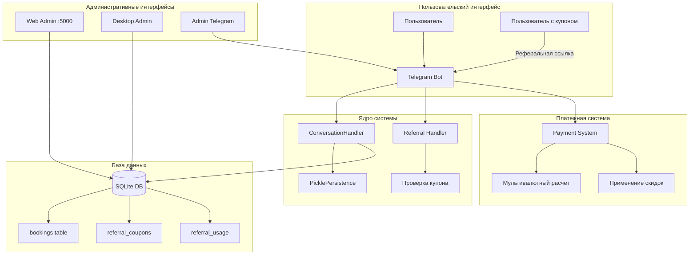
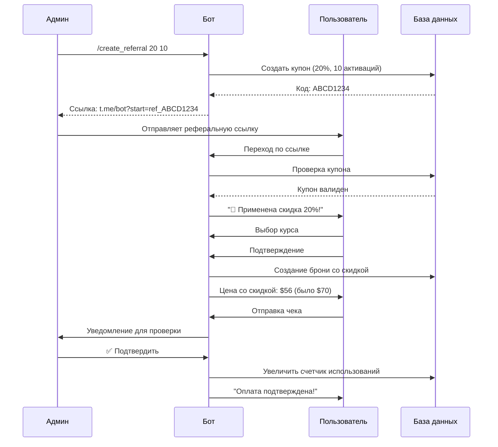

```
 ███╗   ███╗ ██████╗ ███████╗ ██████╗ 
 ████╗ ████║██╔═══██╗╚══███╔╝██╔════╝ 
 ██╔████╔██║██║   ██║  ███╔╝ ██║  ███╗
 ██║╚██╔╝██║██║   ██║ ███╔╝  ██║   ██║
 ██║ ╚═╝ ██║╚██████╔╝███████╗╚██████╔╝
 ╚═╝     ╚═╝ ╚═════╝ ╚══════╝ ╚═════╝ 
  ╦ ╦┌─┐┌─┐┬ ┬╔═╗┬  ┌─┐┌─┐┬ ┬
  ╠═╣├─┤└─┐├─┤╚═╗│  ├─┤└─┐├─┤
  ╩ ╩┴ ┴└─┘┴ ┴╚═╝┴─┘┴ ┴└─┘┴ ┴
```

# 🎓 HashSlash School Bot - Комплексная система управления курсами

Мощный Telegram-бот для школы веб-разработки с системой бронирования, оплаты, реферальными программами и административными панелями.

## 🚀 Быстрый запуск

### Первоначальная настройка (один раз):
```bash
# 1. Создайте виртуальное окружение
python3 -m venv venv

# 2. Активируйте виртуальное окружение
source venv/bin/activate  # На macOS/Linux
# или
venv\Scripts\activate     # На Windows

# 3. Установите зависимости
pip install -r requirements.txt

# 4. Скопируйте и настройте конфигурацию
cp config.py.example config.py
# Отредактируйте config.py и заполните все необходимые значения
```

### Запуск бота:
```bash
# Активируйте виртуальное окружение (если еще не активировано)
source venv/bin/activate

# Запустите бота
python bot.py
# или
./run.sh
```

### Запуск веб-админки:
```bash
# Активируйте виртуальное окружение (если еще не активировано)
source venv/bin/activate

# Запустите веб-админку
python web_admin.py
# или
./start_web_admin.sh
```
Откройте http://localhost:5000

### Запуск desktop-админки:
```bash
# Активируйте виртуальное окружение (если еще не активировано)
source venv/bin/activate

# Запустите desktop-админку
python admin_panel.py
# или двойной клик на start_admin_panel.command (macOS)
```

## 🌟 Ключевые возможности

### Для пользователей
- 📚 **Выбор курсов и консультаций** - Вайб Кодинг, Blockchain, ChatGPT
- 💳 **Мультивалютная оплата** - RUB (Т-Банк), KZT (Kaspi), ARS, USDT
- 🎟️ **Реферальная система** - Скидки 10% и 20% по купонам
- 📸 **Загрузка чеков** - Простая отправка фото для подтверждения
- ⏰ **Бронирование на 1 час** - Резервирование места до оплаты
- 📅 **Календарь консультаций** - Автоматическая отправка ссылки после оплаты

### Для администраторов
- 🖥️ **Веб-панель управления** - Flask-интерфейс на порту 5000
- 🖱️ **Desktop-приложение** - Tkinter GUI для локального управления
- 📊 **Детальная статистика** - По курсам, статусам, времени
- 💬 **Массовая рассылка** - Отправка сообщений подтвержденным участникам
- 🎫 **Управление купонами** - Создание и мониторинг реферальных кодов
- 🔔 **Мгновенные уведомления** - Inline-кнопки для быстрой модерации

## 🏗️ Архитектура системы



## 🔄 Процесс работы с реферальной системой



## 📦 Структура проекта

```
170525/
├── bot.py                    # Основной бот с реферальной системой
├── config.py.example         # Пример конфигурации
├── referral_config.py        # Настройки реферальной системы
├── web_admin.py             # Веб-интерфейс администратора
├── admin_panel.py           # Desktop GUI администратора
├── templates/               # HTML шаблоны для веб-интерфейса
│   ├── base.html
│   ├── index.html
│   ├── confirmed.html
│   ├── unconfirmed.html
│   ├── messaging.html
│   └── referrals.html      # Управление купонами
├── send_message_to_confirmed.py  # Скрипт массовой рассылки
├── get_confirmed_users.py        # Получение списка подтвержденных
├── get_unconfirmed_users.py      # Получение списка неподтвержденных
├── delete_test_user.py           # Удаление тестовых данных
├── requirements.txt              # Зависимости проекта
└── run.sh                       # Скрипт запуска бота
```

## 🛠 Технический стек

- **Python 3.11+** - Основной язык
- **python-telegram-bot v20+** - Асинхронный Telegram API
- **SQLite3** - База данных с автомиграциями
- **Flask** - Веб-интерфейс администратора
- **Tkinter** - Desktop GUI
- **PicklePersistence** - Сохранение состояний

## ⚙️ Установка и настройка

### 1. Клонирование и установка зависимостей

```bash
git clone https://github.com/your-repo/170525.git
cd 170525
pip install -r requirements.txt
```

### 2. Настройка конфигурации

```bash
cp config.py.example config.py
```

Отредактируйте `config.py`:

```python
BOT_TOKEN = "YOUR_BOT_TOKEN_FROM_BOTFATHER"
ADMIN_CONTACT = "@your_admin_username"
TARGET_CHAT_ID = -1001234567890  # ID чата для уведомлений

# Платежные реквизиты
TBANK_CARD_NUMBER = "1234 5678 9012 3456"
TBANK_CARD_HOLDER = "Имя Фамилия"
KASPI_CARD_NUMBER = "1234 5678 9012 3456"
ARS_ALIAS = "your.alias.cvu"
USDT_TRC20_ADDRESS = "TYourUSDTAddress"
BINANCE_ID = "123456789"

# Курсы валют
USD_TO_RUB_RATE = 95.0
USD_TO_KZT_RATE = 470.0
USD_TO_ARS_RATE = 1000.0
```

### 3. Настройка реферальной системы

Отредактируйте `referral_config.py`:

```python
# ID администраторов, которые могут создавать купоны
REFERRAL_ADMIN_IDS = [123456789, 987654321]

# Добавьте новые уровни скидок при необходимости
REFERRAL_DISCOUNTS = {
    10: {"default_activations": 50, "description": "10% скидка"},
    20: {"default_activations": 20, "description": "20% скидка"},
    30: {"default_activations": 10, "description": "30% скидка"},
}
```

### 4. Запуск компонентов

**Telegram бот:**
```bash
python bot.py
# или
./run.sh
```

**Веб-панель администратора:**
```bash
python web_admin.py
# Откройте http://localhost:5000
```

**Desktop приложение:**
```bash
python admin_panel.py
# или двойной клик на start_admin_panel.command (macOS)
```

## 📋 Команды бота

### Для пользователей
- `/start` - Начать работу с ботом
- `/start ref_CODE` - Активировать реферальный купон
- `/reset` - Сбросить текущую сессию (очистить купон и данные)

### Для администраторов
- `/create_referral [процент] [количество]` - Создать купон
  - Пример: `/create_referral 20 10` (20% скидка, 10 использований)
- `/referral_stats` - Статистика по купонам

## 🖥️ Веб-интерфейс администратора

### Доступные страницы:
- **/** - Главная страница со статистикой
- **/confirmed** - Список подтвержденных участников
- **/unconfirmed** - Ожидающие подтверждения
- **/referrals** - Управление реферальными купонами
- **/prepare-messaging** - Подготовка массовой рассылки

### Функции управления купонами:
- Создание новых купонов с настраиваемыми параметрами
- Просмотр статистики использования
- Активация/деактивация купонов
- Копирование реферальных ссылок

## 🗄️ Структура базы данных

### Таблица `bookings`
```sql
id INTEGER PRIMARY KEY
user_id INTEGER
username TEXT
first_name TEXT
chosen_course TEXT
course_id TEXT
confirmed INTEGER (0=pending, 1=uploaded, 2=approved, -1=cancelled)
referral_code TEXT
discount_percent INTEGER
created_at TIMESTAMP
```

### Таблица `referral_coupons`
```sql
id INTEGER PRIMARY KEY
code TEXT UNIQUE
discount_percent INTEGER
max_activations INTEGER
current_activations INTEGER
created_by INTEGER
created_at TIMESTAMP
is_active INTEGER
```

### Таблица `referral_usage`
```sql
id INTEGER PRIMARY KEY
coupon_id INTEGER
user_id INTEGER
booking_id INTEGER
used_at TIMESTAMP
```

## 🔒 Безопасность

- Все конфиденциальные данные в `config.py` (в `.gitignore`)
- Проверка прав администратора для критичных команд
- Защита от повторного использования купонов
- Валидация всех входных данных
- Автоматическое экранирование для MarkdownV2

## 🚀 Развертывание

### Systemd service (Linux)
```ini
[Unit]
Description=HashSlash School Bot
After=network.target

[Service]
Type=simple
User=your_user
WorkingDirectory=/path/to/170525
ExecStart=/usr/bin/python3 /path/to/170525/bot.py
Restart=always

[Install]
WantedBy=multi-user.target
```

### Docker (опционально)
```dockerfile
FROM python:3.11-slim
WORKDIR /app
COPY requirements.txt .
RUN pip install -r requirements.txt
COPY . .
CMD ["python", "bot.py"]
```

## 📈 Мониторинг и логи

- Основные логи: `bot.log`
- Логи выбора курсов: `course_selection.log`
- Веб-панель показывает статистику в реальном времени
- Desktop приложение для быстрого просмотра данных

## 🤝 Поддержка

При возникновении проблем:
1. Проверьте логи на наличие ошибок
2. Убедитесь, что все зависимости установлены
3. Проверьте правильность конфигурации
4. Свяжитесь с администратором через указанный контакт

## 📝 Лицензия

MIT License - свободное использование и модификация

## 🛠 Технические детали

- **Язык**: Python 3.11+
- **Библиотеки**: python-telegram-bot, SQLite3
- **Хранение данных**: SQLite база данных (`bookings.db`)
- **Состояния**: Сохранение контекста между перезапусками

## ⚙️ Установка

1. Клонируйте репозиторий:
   ```bash
   git clone https://github.com/riiiiiiiiis/hsl-mozg.git
   cd hsl-mozg
   ```

2. Установите зависимости:
   ```bash
   pip install -r requirements.txt
   ```

3. Настройте конфигурацию:
   ```bash
   cp config.py.example config.py
   # Отредактируйте config.py, добавив свои данные
   ```

4. Запустите бота:
   ```bash
   python bot.py
   ```
   или
   ```bash
   ./run.sh
   ```

## 📋 Требования к конфигурации

Перед запуском заполните `config.py`:
- `BOT_TOKEN` - токен вашего бота от @BotFather
- `ADMIN_CONTACT` - контакт для связи с администратором
- `TARGET_CHAT_ID` - ID чата для уведомлений
- Реквизиты для оплаты

## 🔒 Безопасность

- Конфиденциальные данные хранятся в `config.py` (включен в `.gitignore`)
- Все платежные реквизиты настраиваются в конфигурации
- Рекомендуется использовать бота в закрытых чатах

## 📝 Лицензия

MIT
