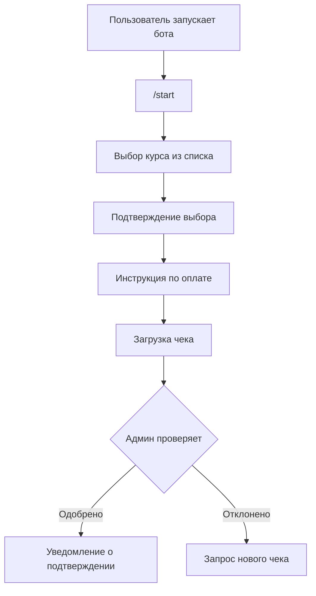

```
 ███▄ ▄███▓ ▒█████  ▒███████▒  ▄████ 
▓██▒▀█▀ ██▒▒██▒  ██▒▒ ▒ ▒ ▄▀░ ██▒ ▀█▒
▓██    ▓██░▒██░  ██▒░ ▒ ▄▀▒░ ▒██░▄▄▄░
▒██    ▒██ ▒██   ██░  ▄▀▒   ░░▓█  ██▓
▒██▒   ░██▒░ ████▓▒░▒███████▒░▒▓███▀▒
░ ▒░   ░  ░░ ▒░▒░▒░ ░▒▒ ▓░▒░▒ ░▒   ▒ 
░  ░      ░  ░ ▒ ▒░ ░░▒ ▒ ░ ▒  ░   ░ 
░      ░   ░ ░ ░ ▒  ░ ░ ░ ░ ░░ ░   ░ 
       ░       ░ ░    ░ ░          ░ 
                    ░                 
```

# Бот для бронирования курса "Вайб Кодинг"

Телеграм-бот для записи на курс с возможностью выбора даты и подтверждения оплаты.

## 🚀 Основные возможности

- 📅 Выбор даты курса из доступных вариантов
- 💳 Подробная инструкция по оплате (карта или криптовалюта)
- 📸 Загрузка чека об оплате
- 👨‍💻 Автоматическое уведомление администратора о новых заявках
- ✅ Простая модерация заявок через кнопки

## 🔄 Процесс работы



## 🛠 Технические детали

- **Язык**: Python 3.11+
- **Библиотеки**: python-telegram-bot, SQLite3
- **Хранение данных**: SQLite база данных (`bookings.db`)
- **Состояния**: Сохранение контекста между перезапусками

## ⚙️ Установка

1. Клонируйте репозиторий:
   ```bash
   git clone https://github.com/riiiiiiiiis/hsl-mozg.git
   cd hsl-mozg
   ```

2. Установите зависимости:
   ```bash
   pip install -r requirements.txt
   ```

3. Настройте конфигурацию:
   ```bash
   cp config.py.example config.py
   # Отредактируйте config.py, добавив свои данные
   ```

4. Запустите бота:
   ```bash
   python bot.py
   ```
   или
   ```bash
   ./run.sh
   ```

## 📋 Требования к конфигурации

Перед запуском заполните `config.py`:
- `BOT_TOKEN` - токен вашего бота от @BotFather
- `ADMIN_CONTACT` - контакт для связи с администратором
- `TARGET_CHAT_ID` - ID чата для уведомлений
- Реквизиты для оплаты

## 🔒 Безопасность

- Конфиденциальные данные хранятся в `config.py` (включен в `.gitignore`)
- Все платежные реквизиты настраиваются в конфигурации
- Рекомендуется использовать бота в закрытых чатах

## 📝 Лицензия

MIT
